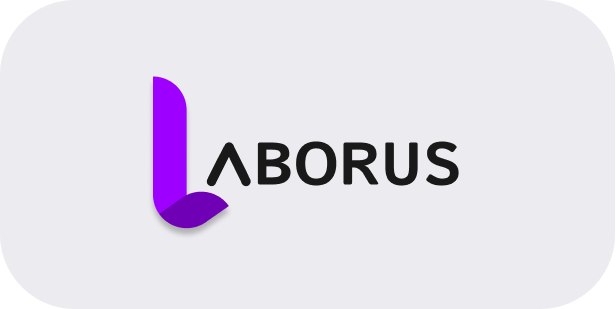

## Sobre

Na Era Digital em que vivemos, muitos processos ficaram mais fáceis e acessíveis com apenas um clique.

No entanto, no mercado de trabalho, as coisas continuam atualizadas e muitos profissionais em início de carreira enfrentam dificuldades para ingressar no mundo corporativo ou aprimorar suas habilidades nas áreas em que desejam atuar. Dessa forma, a rede social acadêmica LABORUS pode contribuir para a resolução desses problemas, atuando como mediadora na comunicação entre alunos e instituições de ensino.

Oferecemos uma plataforma moderna para facilitar o acesso a informações importantes e oportunidades de emprego, contribuindo para o alcance do Objetivo de Desenvolvimento Sustentável 4 (ODS 4).

## Tecnologias

* Dart / Flutter
* MongoDB
* Javascript / NodeJS / Express

## Autor

[@Laborus](https://github.com/Laborus/Laborus_Application.git)

